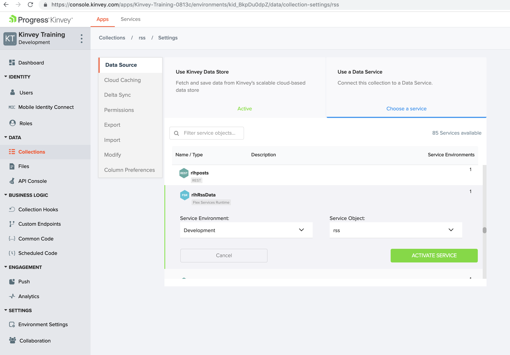

 Kinvey FlexServices Training

## Create service using kinvey console
In the Kinvey Console, choose the "Service Catalog" tab at the top of the page and then click the "Add a Service" button on the right hand side of the page.

https://console.kinvey.com

## Deploying Flex Service
https://devcenter.kinvey.com/rest/guides/flexservice-runtime

The deploy operation sends your service code to Kinvey, processes it, and deploys it to the FlexService Runtime. This process can take up to several minutes depending on network conditions, the number of dependencies, and other factors. Each deploy request returns an ID which can be used with the flex job [id] command to check the status of a pending deploy. Skipping the ID shows status information about the most recent job.

```
$ kinvey init
? E-mail john.doe@kinvey.com
? Password ***********
? Instance ID (optional) kvy-us1
? Profile name dev

$ kinvey flex init

$ kinvey flex deploy
```
## Add Flex Service to Collection

